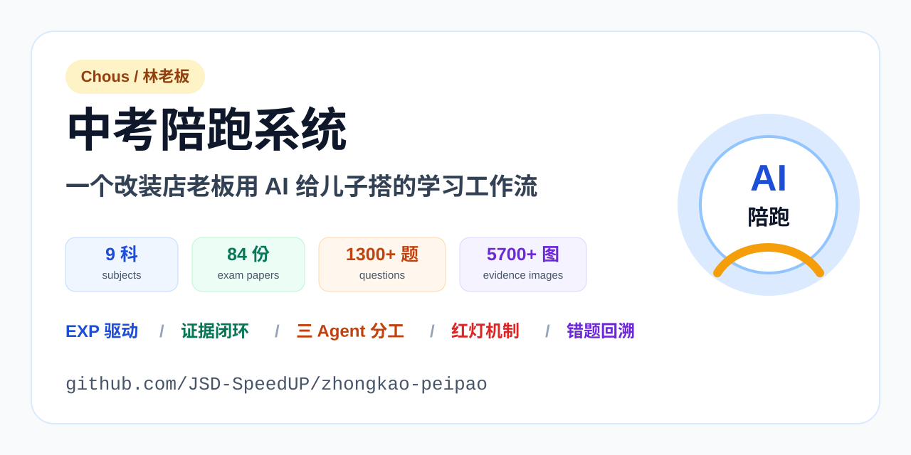
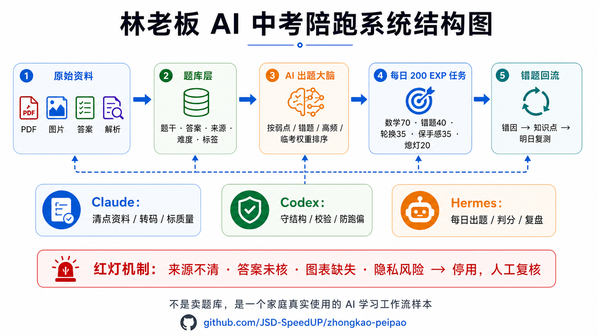
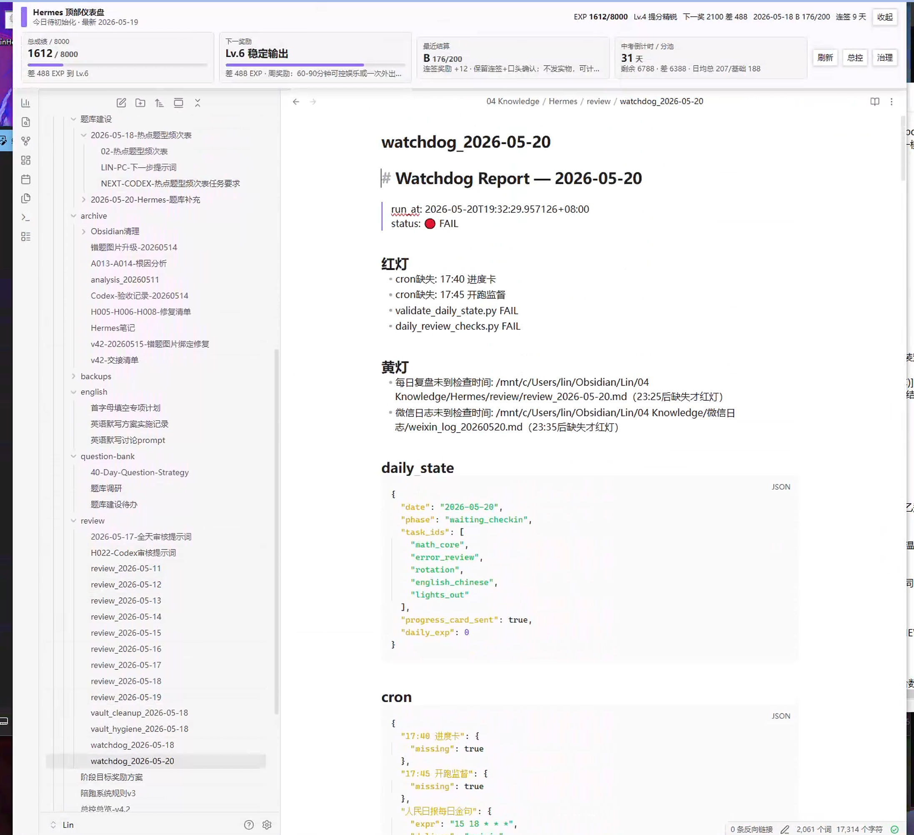
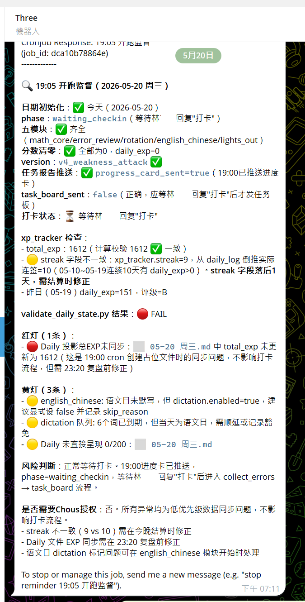

# 中考陪跑系统



> 一个改装店老板花两个月，给儿子搭的中考备考自动化系统。  
> 儿子用着，节奏稳了。整理出来，免费给有需要的人。

**License**: MIT · **Status**: 给儿子使用中，功能稳定 · **维护承诺**: 无，见下方说明

---

## 这是什么

一套面向中考备考、有状态、有反馈、有错题回炉机制的自动化学习系统。

- **孩子端**：微信拍照交作业，自动判分 + 错题分析
- **家长端**：学习情况自动汇总，每日推送
- **后台**：多 Agent 状态机 + 监督机制，**AI 不审自己**

公开仓库不是完整私有系统，也不包含真实题库、学生数据和家庭使用记录。这里保留的是方法、结构、schema 和能跑通的样例流程。

## 为什么做

请过复旦在校生上门一对一。他自己课多，三天打鱼两天晒网，关系处不起来，钱花了不少，成绩纹丝不动。

送过机构补课。现在管得严，能补的远又贵，来回路上比上课还久。最要命的是，孩子为了应付辅导班作业，连学校作业都开始缺。本来想加把力，结果他节奏全乱了。

市面上没现成能用的。我自己上。

我是开汽车改装店的，2026 年 3 月才开始接触 AI。两个月一边学一边搭，搭出这套东西。

## 系统长什么样

下面三张图展示系统结构、Obsidian 工作区和微信报告形态。







## 核心设计思想

> **我从不让 AI 自己判断自己做的对不对。每一层只对上一层负责，最上面那个人是我。**

### 1. 状态机驱动，不是对话驱动

每道题都有明确的状态流转：

```text
待判分 -> 判分完成 -> 错题入库 -> 待回炉 -> 回炉通过
```

每一步规则写死，上一步没完成下一步走不了。状态由脚本管理，不由 LLM 自由发挥。

### 2. 三层 Agent，谁都不审自己

- **判分 Agent**：只判分，不审核自己
- **审核 Agent**：不参与判分，只看判分记录，裁判和运动员分开
- **监督 Agent**：更高一层，检查所有 Agent 的行为记录，每晚自动复盘，异常推报告

这套设计是这个系统区别于“找 AI 聊两句”玩具的根本。AI 自己审自己，就是市面上 AI 落地大量翻车的根本原因。

### 3. 错题回炉，不是简单背答案

错题不会就这么过去。系统记下来，几天后**换一种出法**再考。

不是原题重做，原题背答案就糊弄了。同知识点换角度，再错再换，直到连续做对，这个点才算关。

### 4. 红灯机制，先停再查

遇到来源不清、答案没复核、图片表格缺失、错题回流异常、隐私风险这些情况，系统直接亮红灯。

红灯不是报错提示，而是防止系统把错误内容继续喂给孩子。

## 快速开始

公开版只保留最小可运行样例，用来验证题目 schema、EXP、证据闭环和红灯检查。

### 环境要求

- Python 3.10+
- 无第三方依赖
- 不需要 LLM API key
- 样例题为自出题，不包含任何真实题库内容

### 安装

```bash
git clone https://github.com/JSD-SpeedUP/zhongkao-peipao.git
cd zhongkao-peipao
cp config.example.json config.local.json
```

Windows PowerShell 可以用：

```powershell
git clone https://github.com/JSD-SpeedUP/zhongkao-peipao.git
cd zhongkao-peipao
Copy-Item config.example.json config.local.json
```

### 用样例题库跑通

```bash
python scripts/run_sample.py examples/sample-questions.json --config config.local.json
```

正常输出会看到每道样例题的状态、EXP 和 `evidence_loop: PASS`。

## 题库

**这个仓库不包含题库本体。**

我自己整理的版本基于上海市中考真题 + 各区一二模，覆盖 2013-2025 年，当前私有工作区口径是：9 个科目、84 份考卷、1300+ 道题、5700+ 配图。原始来源问题复杂，无法直接发布。

但 **schema 公开**，你可以自己导入。

题库 schema 支持：

- 选择题，含单选和多选
- 填空题、简答题
- 含表格的题目
- 含图片的题目，使用图片路径引用
- 连线题，左右两组 + 配对关系
- 知识点标签、难度分级、题型分类、来源标记

字段定义和每种题型的 JSON 示例见 [docs/schema.md](docs/schema.md)。

## 仓库内容

- [docs/schema.md](docs/schema.md)：公开题库 schema
- [examples/sample-questions.json](examples/sample-questions.json)：1-2 道自编样例题，只用于跑通系统
- [scripts/run_sample.py](scripts/run_sample.py)：最小样例 runner，演示 EXP、证据检查和红灯机制
- [config.example.json](config.example.json)：三 Agent 分工、EXP 和红灯配置示例

## 关于这个仓库

这不是一个准备运营的开源社区。

这是我给儿子做的私人系统，功能稳定后整理上来，留给有需要的人。

- **没有路线图**
- **没有维护承诺**
- **不接受 PR**
- **不回复 issue**

源码 MIT 协议，自取自用。要二次开发请 fork。

## 关于作者


**林老板 Chous** · 汽车改装店主理人 · AI 自学者

- B 站：加速度SpeedUP https://space.bilibili.com/12170556
- 抖音：林哥教你做改装，抖音号 1155107743
- 小红书：林哥玩改装，账号 26801384926
- 知乎：https://www.zhihu.com/people/sha-mo-wu-yin-56

主业是汽车改装，2026 年 3 月开始接触 AI。这个中考系统是给儿子做的副产品，主线在做**改装店 / 汽美店 / 原厂升级店的 AI 改造方法论**。

如果你是这个行业的店主，想用 AI 改造门店，主战场聊。中考系统的问题这里不回。

## License

[MIT](LICENSE)
